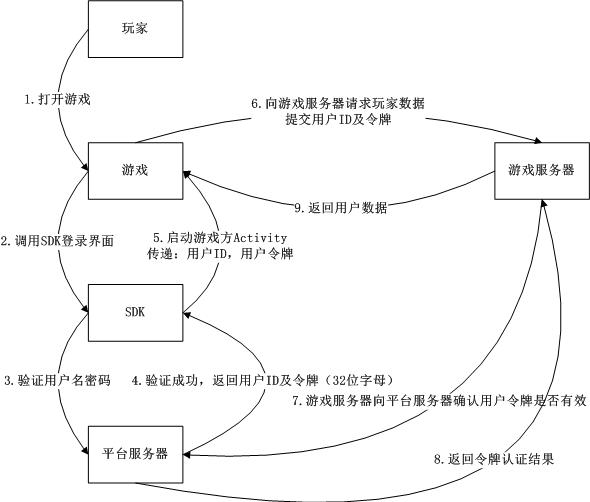
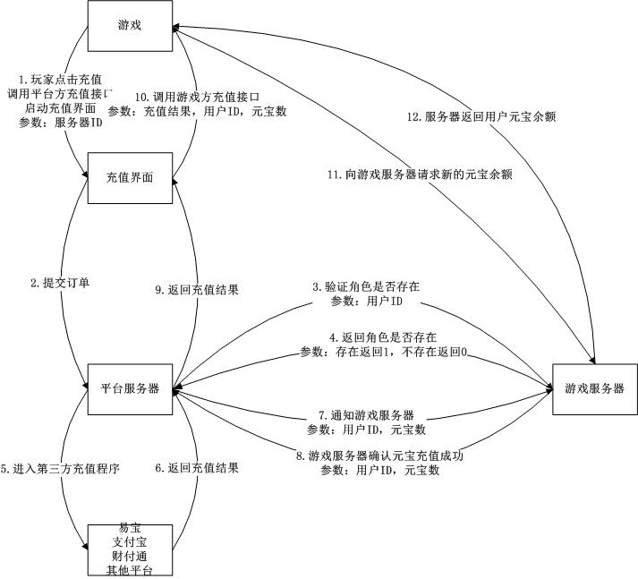

2016/10/20 16:44:52 

# 
天游SDK接入文档

## 一、总体流程

> 天游戏SDK主要提供三方面核心功能：登陆、注册和支付。游戏每次启动，都需要先调用login()接口来进行游戏登陆，通过天游戏账户的userID和token来创建或者查询游戏的id等信息。登陆成功后，根据用户需要，可以调用pay()接口来进行物品购买、充值。

> 用户登录完成进入游戏后，还能展示Gamebar（悬浮的操作栏），用户可在游戏中方便地查询、修改账户信息，领取礼包、联系客服以及修改账号等。

 
## 二、流程介绍

### 1. 登录流程：

> 1) 在上图中的流程1-2，是玩家打开游戏，启动登陆的过程。游戏方需在这里调用SDK的登陆界面，自此后流程操作由SDK完成。

> 2) 直至完成流程3-4，在流程5玩家选择了游戏服务器进入将要进入游戏时，SDK回调游戏方提供的回调对象，将相关数据传递给游戏方，至此SDK完成登录相关流程，此后流程操作由游戏方完成。（具体回调对象信息详见第一章SDK接入）

> 3) 游戏方在接收到SDK传递的数据后，进行流程6-9验证玩家令牌是否有效。若有效在流程9传递玩家信息，若无效则登录失败。

### 2. 充值流程

> 1) 在流程1中，玩家点击充值界面，游戏方需要调用SDK中的充值界面，之后流程操作均由SDK完成。

> 2) 在执行流程3-4时，平台服务器需要向游戏服务器验证当前游戏角色是否存在。需要游戏方提供相应接口，此接口的参数规定由米乐方提供，接口链接最终需游戏方提供给米乐方。

> 3) 在执行流程7-8时，平台服务器需要通知游戏服务器玩家充值的元宝数。需要游戏方提供相应接口，此接口的参数规定由米乐方提供，接口链接最终需游戏方提供给米乐方。
在执行到流程10时，充值完成，SDK调用游戏方提供的回调对象，传递相关参数给游戏方，由游戏方实现游戏中的数据更新。（具体回调对象信息详见第一章SDK接入）

 
## 三、 接入方式

### 1. 接入方式一（添加依赖方式）：

> 推荐使用这种方式接入，后期SDK有jar包或者资源更新（没有接口变化）时只需要替换新的依赖库即可

导入依赖库工程TianyouSdk到eclipse，添加游戏依赖，然后在游戏工程project.properties文件中添加
`manifestmerger.enabled=true`，即可完成接入。

### 2. 接入方式二（拷贝资源方式）：

> 这种方式接入当我们的SDK有jar包或者资源文件更新时需要CP替换相应的文件

将依赖库中的libs目录、res目录下的所有文件拷贝到游戏对应的目录，将`AndroidManifest.xml`中的权限及组件拷贝到游戏`AndroidManifest.xml`文件中即可。

		
 
## 四、 SDK接口

### 测试充值时请使用统一充值账号：15611729501 密码：123456

### 1. 闪屏接口：（必接）

- 将SplashActivity设置为首启项，去掉游戏主Activity的intent-filter

		<activity
            android:name="com.tianyou.sdk.activity.SplashActivity"
            android:screenOrientation="sensorPortrait"
            android:configChanges="keyboard|screenSize|orientation|layoutDirection"
			android:theme="@android:style/Theme.NoTitleBar.Fullscreen" >
            <intent-filter>
                <action android:name="android.intent.action.MAIN" />

                <category android:name="android.intent.category.LAUNCHER" />
            </intent-filter>
        </activity>

- 将游戏的主Activity全路径放到依赖库的`res\values\ty_strings.xml的ty_main_activity`字段中

		<string name="ty_main_activity">com.tianyou.sdk.demo.MainActivity</string>

### 2. 初始化接口：（必接）

在游戏的自定义Application的OnCreate方法或者MainActivity的OnCreate方法中调用如下方法：

### 注意：

> 不能放在Activity的OnCreate方法中；

> 别忘了在Manifest文件中配置Application；

	String gameId = "1020";
	String gameToken = "65cc2c8205a05d7379fa3a6386f710e1";
	/**
	 * gameId：app唯一标识，非常重要，请认真填写，确保正确
	 * gameToken：appkey
	 * isLandscape：游戏横屏为true，竖屏为false
	 */
	Tianyouxi.init(this, gameId, gameToken, false);

### 3. 悬浮窗接口：（必接）

在游戏的MainActivity中加入如下代码：

	Tianyouxi.createFloatMenu(mActivity);

### 4. 登录接口：（必接）

接口原型：

	Tianyouxi.login(Activity activity, String gameName, LoginCallback callback);

参数说明：

* gameName：游戏名（必传）

		Tianyouxi.login(mActivity, "游戏名", new LoginCallback() {
			@Override
			public void onSuccess(String userId, String userToken) {
				ToastUtils.show(mActivity, userId);
			}
			
			@Override
			public void onFailed(String msg) {
				ToastUtils.show(mActivity, msg);
			}
		});

### 5. 支付接口（有选择金额页面）：（必接其中一种支付）

接口原型：

	Tianyouxi.pay(Context context, String payInfo, TianyouCallback callback);

参数说明：payInfo

* roleId：角色ID（必传）
* serverId：服务器ID（必传）
* serverName：服务器名称(必传)
* customInfo：自定义信息(非必传)
* productId：产品ID(必传)
* productName：产品名称(非必传)
* gameName：游戏名称(必传)
* sign：签名验证(必传)
* signType：验证类型(必传)

		try {
			JSONObject payInfo = new JSONObject();
			String roleId = "13141654";
			String serverId = "99990";
			payInfo.put("roleId", roleId);
			payInfo.put("serverId", serverId);
			payInfo.put("serverName", "国内Android测试服");
			payInfo.put("customInfo", "21689575c5284a334ca8f6630127915f9058");
			payInfo.put("productId", "scom.tianyouxi.skszj.p1");
			payInfo.put("productName", "60金钻");
			payInfo.put("gameName", "寻龙剑");
			payInfo.put("sign", AppUtils.MD5(roleId + serverId));
			payInfo.put("signType", "MD5");
			Tianyouxi.pay(mActivity, payInfo.toString(), new TianyouCallback() {
				@Override
				public void onSuccess(String resultMsg) {
					ToastUtils.show(mActivity, "支付成功！");
				}
				
				@Override
				public void onFailed(String resultMsg) {
					ToastUtils.show(mActivity, "支付失败！");
				}
			});
		} catch (JSONException e) {
			e.printStackTrace();
		}

### 6. 支付接口（没有选择金额页面）：（必接其中一种支付）

接口原型：

	Tianyouxi.pay(Context context, String payInfo, int money, String productDesc, TianyouCallback callback);

参数说明：

money：支付金额，单位元，例如1元传1；

productDesc：商品描述；

payInfo：

* roleId：角色ID（必传）
* serverId：服务器ID（必传）
* serverName：服务器名称(必传)
* customInfo：自定义信息(非必传)
* productId：产品ID(必传)
* productName：产品名称(非必传)
* gameName：游戏名称(必传)
* sign：签名验证(必传)
* signType：验证类型(必传)

		try {
			JSONObject payInfo = new JSONObject();
			String roleId = "13141654";
			String serverId = "99990";
			payInfo.put("roleId", roleId);
			payInfo.put("serverId", serverId);
			payInfo.put("serverName", "国内Android测试服");
			payInfo.put("customInfo", "21689575c5284a334ca8f6630127915f9058");
			payInfo.put("productId", "scom.tianyouxi.skszj.p1");
			payInfo.put("productName", "60金钻");
			payInfo.put("gameName", "寻龙剑");
			payInfo.put("sign", AppUtils.MD5(roleId + serverId));
			payInfo.put("signType", "MD5");
			Tianyouxi.pay(mActivity, payInfo.toString(), 15, "超值大大礼包", new TianyouCallback() {
				@Override
				public void onSuccess(String resultMsg) {
					ToastUtils.show(mActivity, "支付成功！");
				}
				
				@Override
				public void onFailed(String resultMsg) {
					ToastUtils.show(mActivity, "支付失败！");
				}
			});
		} catch (JSONException e) {
			e.printStackTrace();
		}

### 7. 进入游戏接口：（必接）

参数说明：

* roleId：角色ID（必传）
* roleLevel：角色等级（必传）
* serverId：服务器ID(必传)
* serverName：服务器名(必传)
* vipLevel：VIP等级(必传)

		try {
			JSONObject roleInfo = new JSONObject();
			roleInfo.put("roleId", "1000");
			roleInfo.put("roleLevel", "100");
			roleInfo.put("serverId", "1000");
			roleInfo.put("serverName", "sName");
			roleInfo.put("vipLevel", "100");
			Tianyouxi.enterGame(mActivity, roleInfo.toString());
		} catch (JSONException e) {
			e.printStackTrace();
		}

### 8. 创建角色接口：（必接）

参数说明：

* roleId：角色ID（必传）
* roleName：角色名称（必传）
* serverId：服务器ID(必传)
* serverName：服务器名(必传)
* profession：角色职业(必传)

		try {
			JSONObject roleInfo = new JSONObject();
			roleInfo.put("roleId", "1000");
			roleInfo.put("roleName", "tom");
			roleInfo.put("serverId", "1000");
			roleInfo.put("serverName", "sName");
			roleInfo.put("profession", "剑圣");
			Tianyouxi.createRole(mActivity, roleInfo.toString());
		} catch (JSONException e) {
			e.printStackTrace();
		}

### 9. 退出游戏接口：（必接）

	Tianyouxi.exitGame(this, new TianyouCallback() {
		@Override
		public void onSuccess(String resultMsg) {
			finish();
			android.os.Process.killProcess(android.os.Process.myPid());
		}
		
		@Override
		public void onFailed(String resultMsg) { }
	});